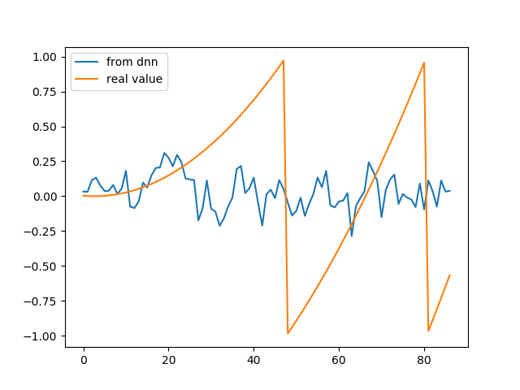

#################
first predections
#################

the model used for the predictions. There was a problem with the input pipeline that mean that the input and output data that was used to train the network were not aligned. This meant that the model learnt the average of the data points and was not very good.

