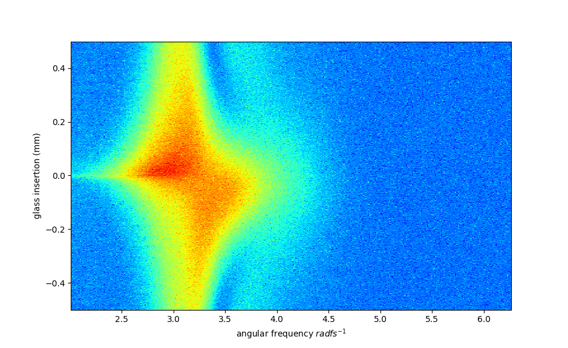
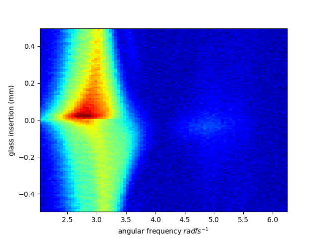
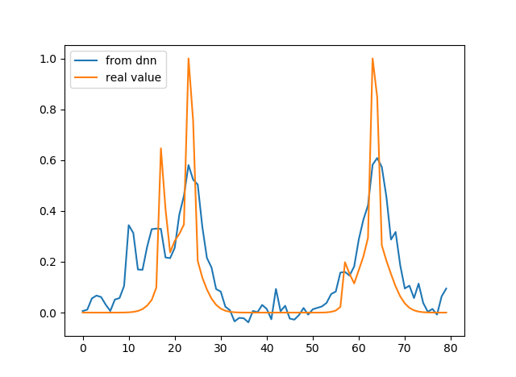
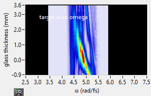
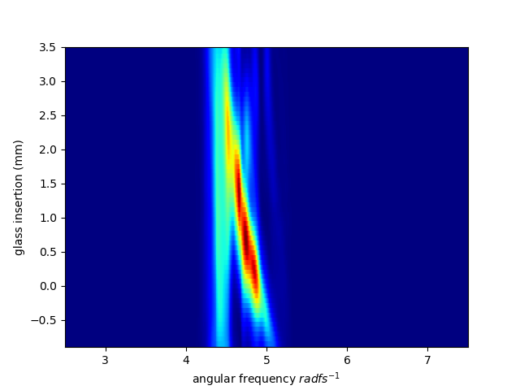

.. D-scan documentation master file, created by
   sphinx-quickstart on Mon Nov 18 12:08:01 2019.
   You can adapt this file completely to your liking, but it should at least
   contain the root `toctree` directive.

Welcome to D-scan's documentation
=================================

.. toctree::
   :maxdepth: 4

   Graphs  <graphs/index.rst>
   First prediction  <graphs/first.rst>
   MaxPool prediction  <graphs/maxpool.rst>
   D_scan_creation  <D-scan-creation.rst>
   dnn_learn  <dnn_learn.rst>
   dnn_predict  <dnn_predict.rst>
   dnn_model  <dnn_model.rst>
   main  <main.rst>
   dataparsing <dataparsing/index.rst>
   about <about.rst>
   
   

  

* :ref:`genindex`
* :ref:`modindex`
* :ref:`search`

